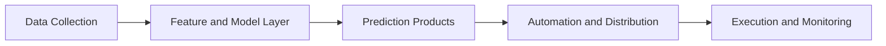

# Signal Pipeline

  
  

<table>
  <tr>
    <td width="20%"><strong>Stage 1</strong> Data Collection</td>
    <td width="80%">
      <a href="https://github.com/bestisblessed/odds-monitoring"><strong>odds-monitoring</strong></a> - line movement and market feed monitoring. 
      <a href="https://github.com/bestisblessed/the-fight-predictor-agent"><strong>the-fight-predictor-agent</strong></a> - agent-driven fight data and content automation.
    </td>
  </tr>
  <tr>
    <td width="20%"><strong>Stage 2</strong> Feature and Model Layer</td>
    <td width="80%">
      <a href="https://github.com/bestisblessed/ai-templates"><strong>ai-templates</strong></a> - reusable inference and assistant patterns. 
      <a href="https://github.com/bestisblessed/ai-local-builds"><strong>ai-local-builds</strong></a> - local model and tool orchestration. 
      <a href="https://github.com/bestisblessed/deepseek"><strong>deepseek</strong></a> - alternate model provider integration.
    </td>
  </tr>
  <tr>
    <td width="20%"><strong>Stage 3</strong> Prediction Products</td>
    <td width="80%">
      <a href="https://github.com/bestisblessed/mma-ai"><strong>mma-ai</strong></a> - MMA prediction application. 
      <a href="https://github.com/bestisblessed/nfl-ai"><strong>nfl-ai</strong></a> - NFL prediction application. 
      <a href="https://github.com/bestisblessed/mlb-ai"><strong>mlb-ai</strong></a> - MLB prediction application.
    </td>
  </tr>
  <tr>
    <td width="20%"><strong>Stage 4</strong> Automation and Distribution</td>
    <td width="80%">
      <a href="https://github.com/bestisblessed/mma-ai-swift-app"><strong>mma-ai-swift-app</strong></a> - mobile distribution channel for predictions. 
      <a href="https://github.com/bestisblessed/oil-ai-dashboard"><strong>oil-ai-dashboard</strong></a> - domain dashboard delivery and monitoring UI.
    </td>
  </tr>
  <tr>
    <td width="20%"><strong>Stage 5</strong> Execution and Monitoring</td>
    <td width="80%">
      <a href="https://github.com/bestisblessed/trading-bots-public"><strong>trading-bots-public</strong></a> - public automation strategy scripts and tests. 
      <a href="https://github.com/bestisblessed/trading-bots-private"><strong>trading-bots-private</strong></a> - private production execution systems.
    </td>
  </tr>
</table>
